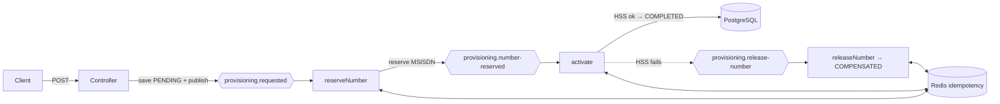

# Telecom Subscriber Provisioning Orchestrator

A compact, **event-driven microservice** that orchestrates a multi-step telecom
subscriber provisioning workflow using the **Saga pattern** over **Apache Kafka**,
with **distributed rollback (compensation)**, **idempotent** processing via **Redis**,
durable state in **PostgreSQL**, **Resilience4j** fault tolerance, and **Prometheus**
metrics. Runs end-to-end with one `docker compose up`.

> Inspired by real telecom provisioning (HSS/UDM): one request must reserve a number
> and activate the service — across independent steps that can fail and must never be
> left half-done.

---

## Concepts demonstrated

| Concept | Where |
|---|---|
| **Saga pattern + compensation** | `SagaListeners` (activation failure → release number) |
| **Kafka** events + consumer group + **dead-letter queue** | `SagaListeners`, `KafkaConfig` |
| **Idempotency** (exactly-once effect over at-least-once delivery) | `IdempotencyService` (Redis `SET NX`) |
| **Eventual consistency** | saga state in PostgreSQL (`ProvisioningRequest`) |
| **Resilience** (retry + circuit breaker) | `HssActivationClient` (Resilience4j) |
| **Observability** | Actuator + Micrometer → `/actuator/prometheus` |
| **Integration testing** | `ProvisioningSagaIntegrationTest` (Testcontainers: Kafka + Postgres + Redis) |

---

## Flow



**Status:** `PENDING → NUMBER_RESERVED → COMPLETED`, or on failure
`PENDING → NUMBER_RESERVED → FAILED → COMPENSATED`.

---

## Tech stack

Java 17 · Spring Boot 3.2 · Apache Kafka · Redis · PostgreSQL · Resilience4j ·
Micrometer/Prometheus · Testcontainers · Docker Compose.

---

## Run it

```bash
docker compose up --build
```

Starts PostgreSQL, Redis, Kafka, the app, and Prometheus.

- App: http://localhost:8080
- Health: http://localhost:8080/actuator/health
- Metrics: http://localhost:8080/actuator/prometheus
- Prometheus UI: http://localhost:9090

### Try it

Happy path:
```bash
curl -i -X POST http://localhost:8080/api/v1/provisioning \
  -H "Content-Type: application/json" \
  -d '{"subscriberName":"Alice","serviceType":"DATA_5G","simulateActivationFailure":false}'
```

Poll status (use the returned `sagaId`):
```bash
curl http://localhost:8080/api/v1/provisioning/{sagaId}
```

Compensation (forced failure → number released):
```bash
curl -i -X POST http://localhost:8080/api/v1/provisioning \
  -H "Content-Type: application/json" \
  -d '{"subscriberName":"Bob","serviceType":"VOLTE","simulateActivationFailure":true}'
```

---

## Test

```bash
mvn test
```

Requires a running Docker daemon (Testcontainers boots real Kafka, PostgreSQL, and
Redis, runs the saga end-to-end, and asserts both COMPLETED and COMPENSATED outcomes).

---

## Project layout (single package, ~13 files)

```
src/main/java/com/abhaypanday/provisioning
├── ProvisioningOrchestratorApplication.java
├── ProvisioningController.java     # REST API
├── ProvisioningService.java        # starts saga + updates state
├── SagaListeners.java              # the whole saga: reserve → activate → compensate
├── KafkaConfig.java                # topic names, topics, DLQ error handler
├── EventPublisher.java             # publish helper (keyed by sagaId)
├── IdempotencyService.java         # Redis-based dedup
├── HssActivationClient.java        # simulated HSS call w/ Resilience4j
├── Events.java                     # all event records
├── Dtos.java                       # request/response records
├── ProvisioningRequest.java        # JPA entity (saga state)
├── ProvisioningStatus.java         # status enum
└── ProvisioningRequestRepository.java
```
